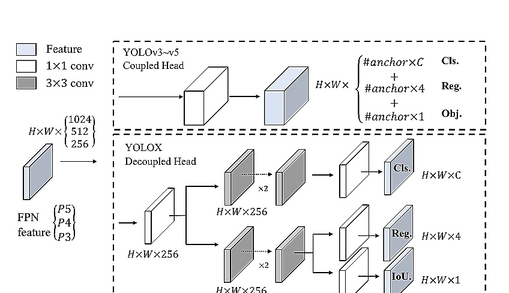

Zheng GeSongtao Liu* Feng Wang Zeming Li Jian Sun Megvii Technology 

{gezheng, liusongtao, wangfeng02, lizeming, sunjian}@megvii.com 

researchers in practical scenes, and we also provide deploy versions with ONNX, TensorRT, NCNN, and Openvino supported. Source code is at https://github.com/Megvii-BaseDetection/YoLox.

With the development of object detection, YOLO series [23,24,25,1,7] always pursuit the optimal speed and accuracy trade-offforreal-time applications. They extract the most advanced detection technologies available at the timeg,ancr]ov2,l for YOLOv3[25]) and optimize theimplementation for best practice. Curetly,YOLOv7]holds the best traeoff performance with 48.2% AP on COCO at 13.7 ms.

Nevertheless, over the past two years, the major advances in object detection academia have focused on anchor-free detectors [29,40,14], advanced labl assignment strategies [37,36,12, 41,22, 4], and endto-end (NMS-free) detectors[2,32,9].These have not en integrated into YOLO families yet, as YOLOv4 and YOLOv5

---

arestillcs rules for training.D1.

That's whatbring usheredelivin those reet a vancements to YOLO seie wit experiencedoptiization. Consideing YOLOv4 and YOLOv may e alitle over-optimized for the anchor-based pipeline,we choose YOLOv325]asoutrtit(weset YOLOv-SPPs the default LOv).IndedLOv3isllft most wdlyued dctorsinteindutydutotelimited computatioeourceandteisuffiientoftwesupport in various practical applications.

As shown in Fig. 1, with the experienced updates of the above techniques,we boost the YOLOv3 to 47.3%AP (YOLOX-DarkNet53) on COCO with $640\times640$ resolution,ursn tecurnt rcticoL (44.3%AP,ultralytics version)by alarge margin.Moreover, when switching to the advanced YOLOv5 architeturethat adopts anadvaced CSNet[1]backboeandan additional PAN[19] head, YOLOX-L achieves 50.0% AP on COCO with $640\times640$ resolution, outperforming the counterpart YOLOv5-L by 1.8% AP. We also test our design strategies on models of small size. YOLOX-Tiny and YOLOX-Nano(only 0.91M Parameters and1.08G FLOPs)outperform the corresponding counterparts YOLOv4-Tiny and NanoDet3by 10% AP and 1.8% AP,repeectively.

We have released our code at https://github.com/Megvii-BaseDetection/YOLOX, with ONNX,TensorRT,NanOviouppredOnee worth mentioning, we won the 1st Place on Streaming Perception Challenge (Workshop on Autonomous Driving at CVPR 2021) using a single YOLOX-L model.

We choose YOLOv3 [25] with Darknet53 as our baseline.In theollowirwwillalktrou tewhole system designs in YOLOX step by step.

Implementation details Our training settings are mostly consistent from the baseline to our final model. We train the models for a total of 300 epochs with 5 epochs warmup on COCO train2017 [17]. We use stochastic gradient descent (SGD) for training. We use a learning rate of l×BatchSize/64(linear scaling8]),withainitial $l r=$ :0.01andthecosinrcdul.Te wgtdcayis0.005and the SGD momentum is 0.9. The batch size is 128 by default to typical 8-GPU devices. Other batch sizes iclude single GPU training also work well. The input size is evenly drawn from448 to 832 with 32 strides.FPS and 

2https://github.com/ultralytics/yolov33https://github.com/RangiLyu/nanodet 

**[表格: table_1_1.jpg]**
<html><body><table><tr><td>Models</td><td>Coupled Head</td><td>Decoupled Head</td></tr><tr><td>Vanilla YOLO End-to-end YOLO</td><td>38.5 34.3 (-4.2)</td><td>39.6 38.8 (-0.8)</td></tr><tr><td></td><td></td><td></td></tr></table></body></html>

latency in this reportare allmasured with FP16-precision and batch=1 on a single Tesla V100.

YOLOv3 baseline Our baseline adopts the architecture of DarkNet53 backbone and an SPP layer, referred to YOLOv3-SPP in some papers [1, 7]. We slightly change some training strategies compared to the original implementation [25], adding EMA weights updaing,cosine r schedule,IoU loss and IoU-aware branch.We use BCE Loss for training cls and obj branch,and IoU Loss for training reg branch. These general training tricks are orthogonal to the key improvement of YOLOX, we thus put them on the baseline.Moreover, we only conduct RandomHorizontalFlip,ColorJitter and multi-scale for data augmentation and discard the RandomResizedCrop strategy, because we found the RandomResizedCrop is kind of overlapped with the planned mosaic augmentation. With those enhancements,ourbaseline achieves 38.5% APon CoCOva,as shown in Tab. 2.

Decoupled head In object detection, the conflict between classification and regression tasks is a well-known problem [27,34]. Thus the decoupled head for classification and localization is widely used in the most of one-stage and two-stage detectors[16,29,35,34]. However, as YOLO series' backbones and feature pyramids(e.g,FPN [13],PAN[20].)continuously evolving,their detection heads rmain coupled as shown in Fig.2.

Our two analytical experiments indicate that the coupled detection head may harm the performance. 1). Replacing YOLO's head with a decoupled one greatly improves the converging speed as shown in Fig. 3. 2). The decoupled head is essential to the end-to-end version of YoL will be described next). One can tell from Tab.1,the end-toend property decreases by 4.2% AP with thecouped head,while the decreasing reduces to 0.8% AP for a decoupled head. We thusreplace the YOLO detecthead with litedecoupled head as in Fig.2. Concretely,it conains a $\mathtt{1\times1}$ conv layer to reduce the channel dimension,followed by two parallel branches with two $3\times3$ conv layers respectively. Wereporttheinference time withbatch= on V00in Tab.2and the lite decoupled head brings additional 1ms (11.6 ms v.s. 10.5 ms).

---

**[图片: figure_2_1.jpg]**

Strong data augmentation We add Mosaic and MixUp into our augmentation strategies to boost YOLOX's performance. Mosaic is an efficient augmentation strategy proposed by ultralytics-YOLOv3.Itisthen widely used in YOLOv4 [1],YOLOv5 [7] and other detectors [3].MixUp]isoriginally desiged forimage classificaon task but then modified inBoF[38]forobject detectiontraining. We adopt the MixUp and Mosaic implementation in our model and closeit for the last15 epochs,achieving 42.0% AP in Tab.2.After using strong data augmentation,we found ImageNet pre-training is no more beneficial, we 

Anchor-free detectors [29, 40, 14] have developed rapidly in the past two year. These works have shown that the performance ofanchorfre detectorscan be on par with anchor-based detectors. Anchor-free mechanism significantly reduces the number of design parameters which need heuristic tuning and many tricks involvedeg,Anchor Clustering24],Grid Sensitive1].for ood formance, making the detector,especially its training and decodingphase,considerably simpler2].

Switching YOLOto ananchor-free manner is quite simple.Wereducetepredctionsforach locationfromo and make them directly predict four values,ie.two offsets in terms of the lef-top cornerof the grid, and the height and width of the predicted box. We assign the center lo

---

**[表格: table_3_2.jpg]**
<html><body><table><thead><tr><td>Methods</td><td>AP(%)</td><td>Parameters</td><td>GFLOPs</td><td>Latency</td><td>FPS</td></tr></thead><tbody><tr><td>YOLOv3-ultralytics{2</td><td>44.3</td><td>63.00M</td><td>157.3</td><td>10.5 ms</td><td>95.2</td></tr><tr><td>YOLOv3 baseline</td><td>38.5</td><td>63.00M</td><td>157.3</td><td>10.5 ms</td><td>95.2</td></tr><tr><td>+decoupled head</td><td>39.6 (+1.1)</td><td>63.86M</td><td>186.0</td><td>11.6 ms</td><td>86.2</td></tr><tr><td>+strong augmentation</td><td>42.0 (+2.4)</td><td>63.86M</td><td>186.0</td><td>11.6 ms</td><td>86.2</td></tr><tr><td>+anchor-free</td><td>42.9 (+0.9)</td><td>63.72M</td><td>185.3</td><td>11.1 ms</td><td>90.1</td></tr><tr><td>+multi positives</td><td>45.0 (+2.1)</td><td>63.72M</td><td>185.3</td><td>11.1 ms</td><td>90.1</td></tr><tr><td>+SimOTA</td><td>47.3(+2.3)</td><td>63.72 M</td><td>185.3</td><td>11.1 ms</td><td>90.1</td></tr><tr><td>+NMS free (optional)</td><td>46.5 (-0.8)</td><td>67.27 M</td><td>205.1</td><td>13.5 ms</td><td>74.1</td></tr></tbody></table></body></html>

cation ofeacjctasthepoitiveampleandpedfi a scale range,asdone in2,to designte the FPN level for each object. Such modificaion reduces the parameters and GFLOPs of the detector and makes it faster,but obtains better performance–42.9% AP as shown in Tab.2.

MultioitieTobecottesgeof YOLOv3,the above anchor-free version selects only ONE positivesamplethecenter location)foreachobjectmeanwhilerteiqulitpreicios.Howeve,mizingthosegqualitreictionsmaalobiee cial gradients,which may alleviatestheextremeimbalance of positive/negative samplin durin training. We simply assigns the center $3\times3$ area as positives, also named "center sampling"iFOs].The perormceof th ecor improves to4.%APasinTab2alrad surasin current estpracticeofultralytics-YOLOv3(44.%P 

SimOTAAdvancedlabel assignmentisanotherimporan progress of object detectioninrcent yearsBasedoour own study OTA[4], we conclude four key insights for an advanced label assignment: 1). loss/quality aware,2).center prior,3).dynamic number of positive anchors4 for each ground-truth (abbreviated as dynamic top-k), 4). global view. OTA meets all four rules above, hence we choose it as a candidate label assigning strategy.

Specifically,OTA[4] analyzes the label assignmentfrom a global perspective and formulate the assigning procedure as an Optimal Transport (OT) problem, producing the SOTA performance among the current assigning strategies [12, 41,36,22,37]. However, in practice we found solving OT problem via Sinkhorn-Knopp algorithm brings 25%extra training time,which isquite expensive for training300epochs.Wethussimliyit to dynamicor egy,named SimOTA,to get an approximatesolion.

4Thetrm"acorreersto"coroitecontxof free detectors and "grid" in the context of YOO.

We briefly introduce SimOTA here. SimOTA first calculates pair-wise matching degree, represented by cost [4,5,12,2]orquality[33]foreach prediction-gt pair.For example,in SimOTA,the cost between gt $g_{i}$ and prediction $p_{j}$ is calculated as:

where λ is a balancing coeficient.$L_{i j}^{c l s}$ and $L_{i j}^{\mathit{r e g}}$ are classficiation loss andreression lossbetweengt giandpredition $p_{j}$ . Then, for gt $g_{i}$ ,we select the top k predictions with the leastcost withinafixedcenterregionasitspositive samples. Finally, the corresponding grids of those positive predictions are assigned as positives, while the rest grids are negatives. Noted that the value k varies for different ground-truth. Please refer to Dynamic k Estimation strategy in OTA [4] for more details.

SimOTA not only reduces the training time but also avoids additional solver hyperparameters in SinkhornKnopp algorithm. As shown in Tab. 2, SimOTA raises the detector from 45.0% AP to 47.3% AP, higher than the SOTA ultralytics-YOLOv3 by 3.0% AP, showing the power of the advanced assigning stratgy.

End-to-end YOLO We follow [39] to add two additional conv layersone-t-one labl assignment,and stopradient.These enable the detector toperformanend-toend manr,but slightly decrasing the performance and the inference speed,as listediTab.2.Wethusleaveitas anoptional module which is not involved in our final models.

Besides DarkNet53, we also test YOLOX on other backbones with different sizes,where YOLOX achieves consistent improvements against all the corresponding counterparts.

---

**[表格: table_4_3.jpg]**
<html><body><table><tr><td>Models</td><td>AP(%)</td><td>Parameters</td><td>GFLOPs</td><td>Latency</td></tr><tr><td>YOLOv5-S YOLOX-S</td><td>36.7 39.6 (+2.9)</td><td>7.3 M 9.0M</td><td>17.1 26.8</td><td>8.7 ms 9.8 ms</td></tr><tr><td>YOLOv5-M YOLOX-M</td><td>44.5 46.4 (+1.9)</td><td>21.4M 25.3M</td><td>51.4 73.8</td><td>11.1 ms 12.3 ms</td></tr><tr><td>YOLOv5-L YOLOX-L</td><td>48.2 50.0 (+1.8)</td><td>47.1M 54.2M</td><td>115.6 155.6</td><td>13.7 ms 14.5 ms</td></tr><tr><td>YOLOv5-X YOLOX-X</td><td>50.4 51.2 (+0.8)</td><td>87.8M 99.1M</td><td>219.0 281.9</td><td>16.0 ms 17.3 ms</td></tr></table></body></html>

**[表格: table_4_4.jpg]**
<html><body><table><tr><td>Models</td><td>AP(%)</td><td>Parameters</td><td>GFLOPs</td></tr><tr><td>YOLOv4-Tiny [30] PPYOLO-Tiny</td><td>21.7</td><td>6.06M 4.20M</td><td>6.96</td></tr><tr><td>YOLOX-Tiny</td><td>22.7 32.8 (+10.1)</td><td>5.06 M</td><td>6.45</td></tr><tr><td>NanoDet3</td><td></td><td></td><td></td></tr><tr><td>YOLOX-Nano</td><td>23.5</td><td>0.95M</td><td>1.20</td></tr><tr><td></td><td>25.3 (+1.8)</td><td>0.91M</td><td>1.08</td></tr></table></body></html>

Modified CSPNet in YOLOv5 To give a fair comparison,we adote exctYLOv5'sbcboencluig modifiedCNt,LUctition,nteA headWealsoolloitscalinuetoproductXS, YOLOX-M, YOLOX-L, and YOLOX-X modelss. Compared to YOLOv5in Tab.3,our modelsetconsiset im provement by~3.0% to~1.0% AP, with only marginal time increasing (comes from the decoupled ead).

Tiny and Nano detectors We further shrink our model as YOLOX-Tiny to compare with YOLOv4-Tiny [30]. For mobile devices, we adopt depth wise convolution to construct a YOLOX-Nano model, which has only 0.91M parameters and 1.08G FLOPs. As shown in Tab. 4, YOLOx performs well with even smaller model size than the counterparts.

Model size and data augmentation In our experiments,all the models keep almost the same learning schedule and optimizing parameters as depicted in 2.1. However, we found that the suitable augmentation strategy varisarss different size of models. As Tab. 5 shows, while applying MixUp for YOLOX-L can improve AP by 0.9%, it is better to weaken the augmentation for small models like 

YOLOX-Nano. Specifically, we remove the mix upagmentation and weaken the mosacreduce the scalerae from[.1,2.]to.5,1.) whetrnsallls i.e.,YOLOX-S,YOLOX-Tny,and YOLOX-No. S modification improves YOLOX-Nano's AP from 24.0% to 25.3%.

For large modlswalso foundthat stronger agmenttionis morehelful.Indeedour MixUpimlemni part of haviertha theoral vrioiIre byCopypaste6,wejitteredbothimages byarandomsampled scale factor before mixinupthem.Toundrstndth power of Mixup with scale jittering, we compae it wih Copypaste on YOLOX-L. Noted that Copypaste requires extrainstance mask annotations while MixUp doesot. Bu as shown in Tab.5,thesetwo methods achievecompetitive performance,indicatingthatMixUp witcaleteingis qualifedreplacemetforCopypste whennoinstancemask annotation is availabl.

**[表格: table_4_5.jpg]**
<html><body><table><tr><td>Models</td><td>Scale Jit.</td><td>Extra Aug.</td><td>AP(%)</td></tr><tr><td rowspan="2">YOLOX-Nano</td><td>[0.5, 1.5] [0.1, 2.0]</td><td>MixUp</td><td>25.3 24.0 (-1.3)</td></tr><tr><td></td><td></td><td></td></tr><tr><td rowspan="2">YOLOX-L</td><td>[0.1, 2.0] [0.1, 2.0]</td><td>MixUp</td><td>48.6 49.5 (+0.9)</td></tr><tr><td></td><td></td><td></td></tr></table></body></html>

There is a tradition to show the SOTA comparing table as in Tab.6. However, keep in mind that the inference speed of the models in this table is often uncontrolled, as seed varies with software and hardware. We thus use the same hardware and code base for all the YOLO series in Fig. 1,plotting the somewhat controlled speed/accuracy curve.

...series with larermodelsies likeScale-YOLOv4[30]and YOLOv5-P6[7].And the current Transformer based detectors [21] push the accuracy-SOTA to ~60 AP. Due to the time and resource limitation, we did not explore those important featuresinthisreport.However,theyarealreadyin our scope.

Streaming Perception Challenge on WAD 2021 is ajoint evaluation of accuracy and latency through a recentlyproposed metric: streaming accuracy[15].The key insightbe

---

**[表格: table_5_6.jpg]**
<html><body><table><tbody><tr><td>Method YOLOv3 + ASFF* [18] [18] $\mathrm{Y O L O v}3+\mathrm{A S F F}^{*}$</td><td>Backbone Darknet-53 Darknet-53</td><td>Size 809 800</td><td>FPS (V100)</td><td>| 42.4 43.9 $\mathbf{A}\mathbf{P}\left(\%\right)$</td><td colspan="5"></td></tr><tr><td>$\mathbf{A}\mathbf{P}_{50}$</td><td>$\mathbf{A}\mathbf{P}_{75}$</td><td>$\mathbf{A}\mathbf{P}_{S}$</td><td>45.7 46.6 $\mathbf{A}\mathbf{P}_{M}$</td><td>52.3 $\mathbf{A}\mathbf{P}_{L}$</td><td>45.5 29.4 98.0</td><td>63.0 64.1</td><td>47.4 49.2</td><td>25.5 27.0 12.0</td><td>53.4 51.2 56.0</td></tr><tr><td>EficientDet-D0 [28] EficientDet-D1 [28]</td><td>Effi  cient-B0 Effi  cient-B1 Efficient-B2 Efficient-B3</td><td>512 640 768 896</td><td>33.8 39.6 43.0 45.8 49.5</td><td>52.2 58.6 62.3 65.0</td><td>35.8 42.3 46.2</td><td>38.3 44.3 47.0</td><td>74.1 56.5 34.5</td><td>17.9 22.5 26.6</td><td>EfficientDet-D2 [28] EfficientDet-D3 [28] PP-YOLOv2 [11] PP-YOLOv2 [11]</td></tr><tr><td>49.3 54.4 55.3</td><td>49.4 52.9</td><td>ResNet50-vd-dcn ResNet101-vd-dcn CSPDarknet-53 Modified CSP</td><td>640 640 809 640</td><td>68.9 50.3 62.0</td><td>68.2 69.0 65.7</td><td>30.7 31.6</td><td>50.3 43.5 47.5</td><td>53.9 46.7 51.2</td><td>62.4 53.3 59.8</td></tr><tr><td>YOLOv4 [1] YOLOv4-CSP [30] YOLOv3-ultralytics2 YOLOv5-M [7]</td><td>47.3 51.7</td><td>26.7 28.2</td><td>73.0 95.2 90.1</td><td>66.2 64.6 63.1 66.9 68.8</td><td>Darknet-53 Modified CSP v5 Modified CSP v5 Modified CSP v5</td><td>640 640 640</td><td>44.3 44.5 48.2</td><td>- ' -</td><td>- - - -</td></tr><tr><td>- -</td><td>-</td><td>- - -</td><td>YOLOv5-L [7] YOLOv5-X [7] YOLOX-DarkNet53</td><td>73.0 62.5 90.1</td><td>-</td><td>640 640</td><td>50.4 47.4 46.4</td><td>- 27.5 26.3</td><td></td></tr><tr><td>Darknet-53 Modified CSP v5 Modified CSP v5 Modified CSP v5</td><td>67.3 65.4 68.5 69.6</td><td>52.1 50.6</td><td>51.5 51.0 54.5 56.1</td><td>60.9 59.9 64.4 66.1</td><td>YOLOX-M YOLOX-L YOLOX-X</td><td>640 640 640</td><td>81.3 69.0 57.8</td><td>50.0 51.2</td><td>54.5 55.7</td></tr></tbody></table></body></html>

hindt perceptiostcktrtieiocts considerthe amouostrmdatashould nored wileomioiccueu thebesttraoffoemicFe is a powerful model with the inference time $\leq33ms$ .So we adopta LOX-modl with TeorRto roductr nalodlctete to the challenge websitefor more details.

In this report, we present some experienced updates to YOLO series, which forms a high-performance anchorfree detector called YOLOX. Equipped with some recent advanced detection techniques, i.e.,decoupld head,anchor-feeanddvcedllsigistrtegyLO achieves a etertradeof betweenspeedand accuracythan other counterparts across all model sizes.It is remarkable that we boost the architecture of YOLOv3, which is still one of the most widely used detectors in industry due to its broad compatibility, to 47.3% AP on COCO, surpassing the current best practice by 3.0% AP. We hope this reort canhelp developers and researchersgetbetterexperienein practical scenes.

This research was supported by National Key R&D Program of China (No.2017YFA0700800).It was also funded by China Postdoctoral Science Foundation (2021M690375)and Beijing Postdoctoral Research Foundation 

---

---
